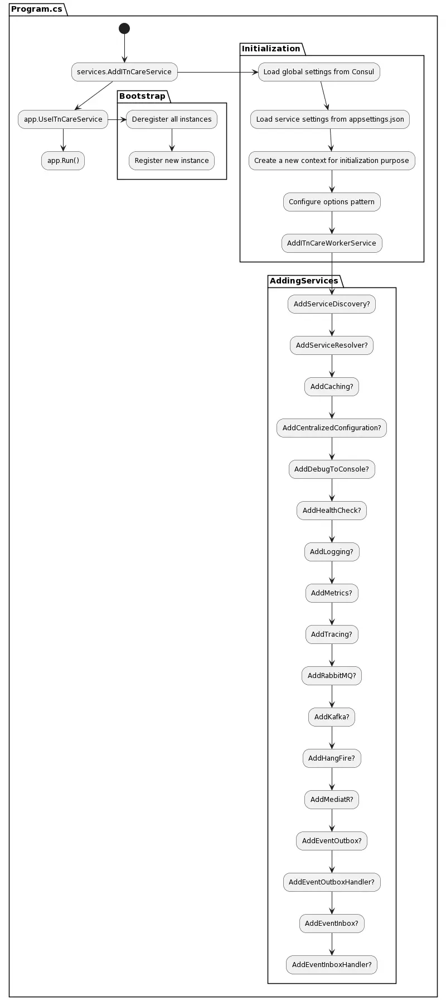

# Manual

## Overview diagram


## Service's local appsettings.json

Each service need the following block of configuration in order to get started successfully.

```json
{
    "ITnCareService": {
        "Name": "ITnCare.MicroserviceA",
        "Consul": {
            "Host": "http://127.0.0.1:8500"
        }
    }
}
```

**Name and host must be replaced with actual data.**


## Service's online configuration

Each service can also have a dedicated appsettings.json inside Consul's Key/Value store.

Sample appsettings.json for a service named ITnCare.Sample:

**Key: ITnCare.Sample/*appsettings.json***

**Value:**

```json
{
  "Serilog": {
    "Using": [ "Serilog.Sinks.Console", "Serilog.Sinks.File" ],
    "MinimumLevel": "Debug",
    "WriteTo": [
      { "Name": "Console" },
      {
        "Name": "File",
        "Args": {
          "path": "logs/log-.txt",
          "outputTemplate": "{Timestamp:o} [{Level:u3}] [{SourceContext}] {Message}{NewLine}{Exception}",
          "rollingInterval": "Day",
          "restrictedToMinimumLevel": "Information"
        }
      }
    ],
    "Enrich": [ "FromLogContext", "WithMachineName", "WithThreadId" ],
    "Destructure": [
      {
        "Name": "ToMaximumDepth",
        "Args": { "maximumDestructuringDepth": 4 }
      },
      {
        "Name": "ToMaximumStringLength",
        "Args": { "maximumStringLength": 100 }
      },
      {
        "Name": "ToMaximumCollectionCount",
        "Args": { "maximumCollectionCount": 10 }
      }
    ]
  },
  "ConnectionStrings": {
    "RedisConnectionString": "localhost",
    "MongoDB": "mongodb://localhost:27017"
  },
  "Name": "ITnCare.Sample",
  "Schema": "https",
  "Host": "localhost",
  "Port": 7281,
  "ApplicationOptions": {
  	"DelayInMs": 91
  },
  "RabbitMQs": {
   	"Local": {
    	"Host": "localhost",
    	"Port": 5672,
    	"Username": "logon",
    	"Password": "logon" 
    }
  },
  "CircuitBreaker": {
		"BasicPolicies": {
    	"Default": {
      	"HandledEventsAllowedBeforeBreaking": 2,
        "DurationOfBreakInMs": 1000
      }
    },
    "AdvancedPolicies": {
    	"Default": {
      	"FailureThreshold": 0.25,
        "SamplingDurationInMs": 1000,
        "MinimumThroughput": 5,
        "DurationOfBreakInMs": 1000
      }
    }
  },
  "TracingEnabled": true
}
```

**Important**
Currently, we can use local appsettings.json or Consul to configure the applications, but we can change the library to read the configs from environments, in that case we can use kubernetes configmap also.

## Global configurations shared between all services

We have a shared configurations between all services which can be get overridden by any service.

```json
{
  "ConnectionStrings": {
    "RedisConnectionString": "LT3357",
    "SqlServerConnectionString": "Data Source=LT3357\\WORK; Initial Catalog=itncare; User Id=sa; Password=Abcd@123456"
  },
  "ServiceDiscovery": {
    "HealthCheck": {
     "Interval": 10,
     "Timeout": 30
    }
  },
  "RabbitMQs":
  {
   	"Default": {
    	"Host": "localhost",
    	"Port": 5672,
    	"Username": "logon",
    	"Password": "logon" 
    }
  },
  "Jaeger": {
   "AgentHost": "localhost",
   "AgentPort": 6831
  },
  "TracingEnabled": true,
  "ServiceUrls": {
    "ITnCare.Sample": "http://LT3357:7281",
    "ITnCare.MicroserviceA": "http://localhost:7001",
    "ITnCare.MicroserviceB": "http://localhost:7002",
    "ITnCare.MicroserviceC": "http://localhost:7003",
    "ITnCare.MicroserviceD": "http://localhost:7004"
  }
}
```

## Services

### AddCentralizedConfiguration<ApplicationOptions>(false, true)
Is used to add a application level configuration which is also stored in Consul.

If the ApplicationOptions structure would be something like the following:

```cs
public class ApplicationOptions
{
    public int DelayInMs { get; set; }
}
```

Then we have to add the following block to **SERVICE_NAME.appsettings.json** in Consul:

```json
{
    "ApplicationOptions": {
  	    "DelayInMs": 91
    }
}
```

We can also configure the library to setup the options using local appsettings.json.

### AddServiceDiscovery()
Is used to handle the registration and deregistrations process.

A service should get registered so the other services can use IServiceResolver to get access to the service's url.

### AddServiceResolver()
Is used to add the functionality to discover other service's url.

**Important: We can also use k8s service discovery in almost most cases, but this is another option and should be decided in scenarios.**

### AddHealthCheck()
Is used to add health checks endpoint to services which is also used by service discovery.

### AddLogging()
Configure the serilog as log service, can be configured in configurations, currently getting logged into a file and console.

### AddMediatR()
Adding MediatR to project.

### AddRabbitMQ()
Adding RabbitMQ to project, so developers can publish messages and also consume messages easily.

### AddTracing()
Is used to add tracing to the project, it uses open telemetry and jaeger for tracing purpose.

### AddEventOutbox()
